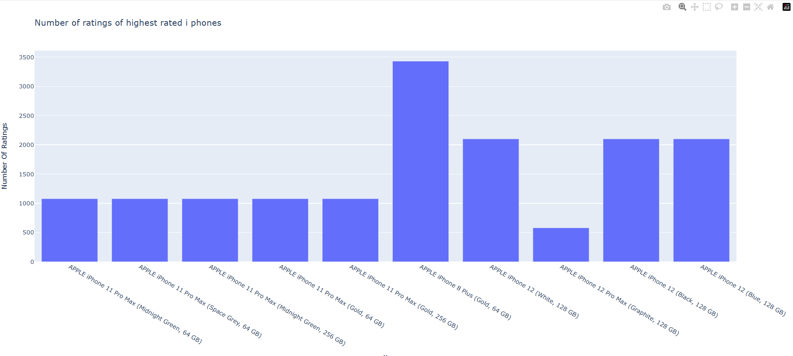
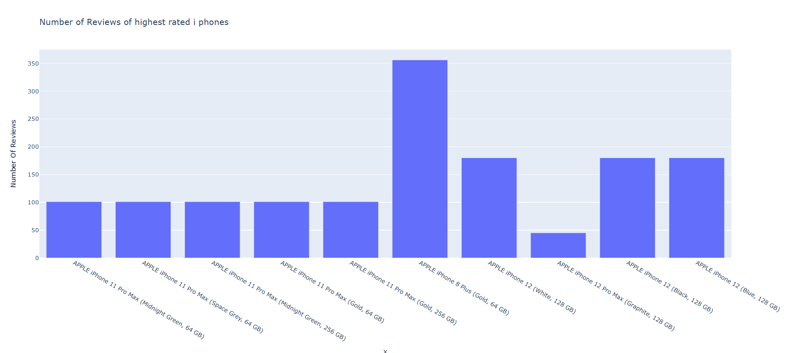
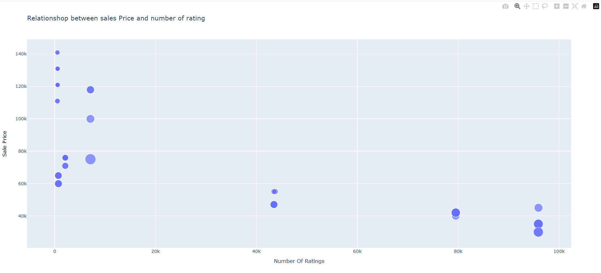

# iphone_sales_analysis


# 📊 iPhone Sales Analysis  

This project analyzes iPhone sales data using **Python, Pandas, NumPy, and Plotly**.  
The goal is to explore ratings, reviews, pricing, and discounts to understand customer behavior and product performance.  

---

## 🔹 Features & Insights
- Data cleaning and descriptive statistics  
- Top 10 highest-rated iPhones  
- Bar charts for **Number of Ratings** and **Number of Reviews**  
- Scatter plots to analyze:  
  - Relationship between Sale Price & Number of Ratings  
  - Relationship between Discount Percentage & Number of Ratings  

---

## 🚀 Technologies Used
- Python 🐍  
- Pandas & NumPy (Data Processing)  
- Plotly Express & Graph Objects (Data Visualization)  

---

## 📸 Screenshots  

### 1️⃣ Top 10 Highest Rated iPhones  
  

### 2️⃣ Number of Reviews of Highest Rated iPhones  
  

### 3️⃣ Relationship Between Price & Ratings  
  

###  Relationship Between Discount & Ratings  
---

## 📌 How to Run
1. Install Python 3.x  
2. Install required libraries:  
   ```bash
   pip install pandas numpy plotly
